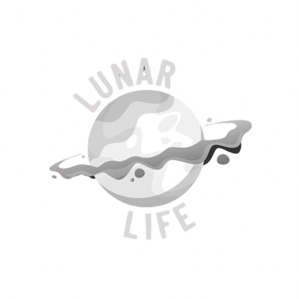

# Project LunarLife

<div align="center">
  
</div>

<br>

<div align="center" style="margin-top: 1em; margin-bottom: 1em;">
  <a href="https://www.spaceappschallenge.org/2025/find-a-team/the-officials/?tab=details" target="_blank">
    
  </a>
  &nbsp;
  <a href="https://drive.google.com/drive/folders/1_wZlx6Gok_gQpxq_MUXj3_VlhsbM8SDd?usp=sharing" target="_blank">
    
  </a>
</div>

**Project LunarLife** is an AI-powered bioscience exploration platform that enables scientists, mission planners, and enthusiasts to analyze and visualize over 600 NASA Space Biology publications using summarization, knowledge graphs, and intelligent search.

_Built for the **NASA Space Apps Challenge 2025**, LunarLife bridges the gap between space research data and human insight._

## Features

- **Smart Search**: Search publications by keywords (e.g., radiation, plants, immune system).
- **AI Summaries**: Automatic summarization of research abstracts using transformer models.
- **Knowledge Graphs**: Visualize connections between studies, keywords, and biological systems.
- **Interactive Dashboard**: Built with [Streamlit](https://streamlit.io) for fast, user-friendly exploration.
- **Multi-AI Support**: Seamlessly switch between OpenAI and Ollama models.
- **Modular Architecture**: Easy to extend for future datasets or AI tools.

---

## Project Overview

**LunarLife** enables users to explore NASA Space Biology research in an interactive, AI-powered environment. It bridges the gap between raw data and actionable insight by providing summaries, interactive graphs, and an AI chat interface. This helps researchers, mission planners, and students quickly understand trends, interconnections, and key findings from hundreds of publications.

---

## How It Works

1. **Data Ingestion:** Fetches publications and abstracts from NASA databases and verifies metadata via PubMed/NCBI.
2. **AI Summarization:** Uses GPT-4 and Ollama models to generate concise summaries and answer user queries.
3. **Knowledge Graphs:** Extracts relationships between biological entities, experiments, and missions to visualize connections.
4. **Interactive Chat:** Users can ask natural language questions and receive context-aware answers.
5. **Dynamic Dashboard:** Streamlit interface provides search, filter, and graph exploration capabilities.

---

## Benefits

- Accelerates literature review by summarizing complex research.
- Visualizes hidden relationships in space bioscience data.
- Facilitates mission planning and research prioritization.
- Supports both educational and professional use cases.

---

## Installation & Usage

- Ensure Python 3.9+ and virtual environment setup.
- Install dependencies: `pip install -r requirements.txt`
- Set OpenAI API key if using GPT-4: `export OPENAI_API_KEY="your_api_key"`
- Run `python fetch_abstracts.py` if dataset not already downloaded.
- Launch the dashboard: `streamlit run Dashboard.py`
- Access in browser: `http://localhost:8501`

---

## Future Enhancements

- Expand dataset with more NASA and international space biology studies.
- Integrate automated citation and trend analysis.
- Add collaborative features for research teams.
- Include visualization enhancements (3D graphs, mission timelines).

---

## References & Resources

- NASA Space Biology Publications: https://github.com/jgalazka/SB_publications/tree/main
- NASA Open Science Data Repository: https://osdr.nasa.gov/
- NASA Life Sciences Data Archive: https://lsda.jsc.nasa.gov/
- PubMed / NCBI for metadata verification: https://pubmed.ncbi.nlm.nih.gov/

---

## Project Structure

```
Project LunarLife /
│── Dashboard.py                # Main Streamlit app (search + summaries + knowledge graph)
│── fetch_abstracts.py         # To pull the abstracts via NCBI
│── requirements.txt           # Python dependencies
│── README.md                  # Project description
│── data/
│   │── publications_with_abstracts.csv  # CSV containing titles, links, and abstracts
│   └── publications.csv                 # CSV containing titles, links
│── src/
│   ├── preprocess.py          # Data cleaning & parsing
│   ├── summarizer.py          # AI-based summarization & Q&A (OpenAI & Ollama)
│   └── search.py              # Search & filtering of publications
│── pages/
│   ├── 2_Summarizer.py          # Paper Summarizer page
│   └── 3_Chat.py                # AI Chat interface for publications
│── assets/
│   ├── demo_slides.pdf        # Demo slides for submission
│   └── nasa_logo.png          # logo

```

---

## Quick Start

1. Clone the repo:

   ```bash
   git clone https://github.com/OfficiallyMrDev/ProjectLunarLife.git
   cd ProjectLunarLife
   ```

2. Install dependencies:

   ```bash
   pip install -r requirements.txt
   ```

3. Set up AI API keys (optional for OpenAI):

   ```bash
   export OPENAI_API_KEY="your_openai_api_key"
   ```

4. Run "fetch_abstracts.py" to fetch the publications with the abstracts (If publications_with_abstracts.csv doesn't exist):

   ```bash
   python fetch_abstracts.py
   ```

5. Run the app:

   ```bash
   streamlit run Dashboard.py
   ```

6. Open in your browser at:
   ```bash
   http://localhost:8501
   ```

## Tech Stack

    •	Python 3.9+
    •	Streamlit – Dashboard UI
    •	OpenAI GPT‑4 & Ollama (local models) – AI summarization and chat
    •	Pandas – Data handling
    •	NetworkX – Knowledge graph
    •	Matplotlib & PyVis – Visualization

## Data Sources (NASA)

    •	NASA Space Biology Publications (608 studies)
    •	NASA Open Science Data Repository (OSDR)
    •	NASA Space Life Sciences Library (NSLSL)
    •	NASA Task Book
    •	NASA Life Sciences Data Archive (LSDA)
    •	PubMed / NCBI for metadata verification

⸻

## Team & Credits

Developed for the **NASA Space Apps Challenge 2025** by **Team TheOfficials**. Powered by open-source tools, AI, and NASA’s public bioscience datasets.

---

## Project Screenshots

Here’s a preview of the LunarLife interface showcasing real-time AI summarization and interactive chat capabilities.

### Dashboard Interface

An overview of the LunarLife dashboard and navigation layout.


---

### AI Summarizer & Chat

Demonstrating the AI Summarizer in action and its interactive chat assistant.


---
